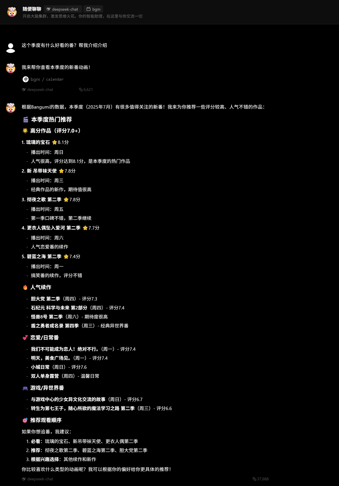
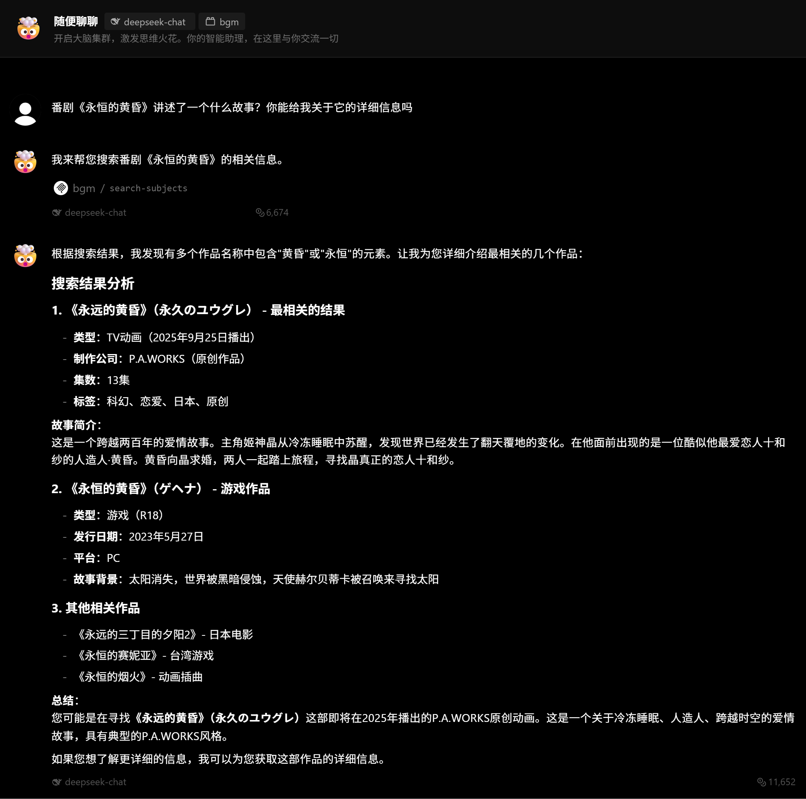

# BGM MCP

这是一个非官方的 Bangumi MCP 服务

该 MCP 实现 2025/06/18 中的 Streamable HTTP transport

## 使用方法

首先你需要前往 <https://bgm.mcp.zhexin.org/authorize> 进行授权，授权成功获取 Token 后即可使用 MCP 服务。

你可以像这样使用它：

```http
POST /mcp HTTP/1.1
Authorization: Bearer $YOUR_TOKEN
Host: bgm.mcp.zhexin.org
Content-Type: application/json
```

> [!IMPORTANT]
> 该 token 有效期为 7 天

任意支持 Bearer 认证和 Streamable HTTP transport 的 LLM 客户端均可使用该 MCP 服务

## 可用的 tool

该 MCP 封装了 <https://bangumi.github.io/api/> 的

- 条目
- 章节
- 人物
- 角色
- 用户
- 收藏

中不包括图片相关的 API

### 示例






